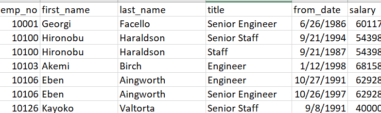
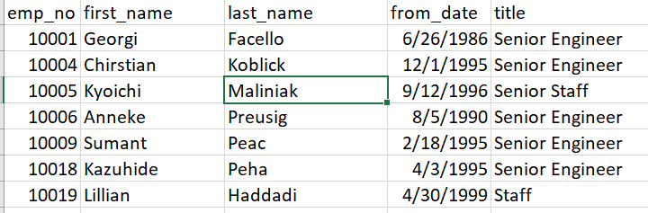
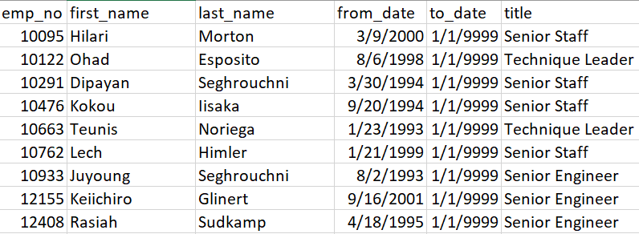

# Pewlett-Hackard-Analysis

<strong><u>Project Summary:</u></strong>

The goal of this project was to identify employees that are ready for mentor.&nbsp; ERD.png has the data relationship diagram

Total number of individuals retiring are &nbsp; &nbsp; 71193

Total number of individuals hired are &nbsp; &nbsp; 300024

Total number of individuals available for mentorship are &nbsp; &nbsp; 1549

 

<B>Suggestion for future analysis:</B> The next analysis should consist of realted fields and individuals with specific designation for mentor. We can also analyse the trend for positions that individuals are going through during their career and HR could use that data for designing career growth pathways. 

<h4 style="margin: 20px 0px 15px; font-family: Raleway, sans-serif; font-weight: 800; line-height: 1; text-rendering: optimizelegibility; font-size: 1.5em; color: var(--primary); font-style: normal; font-variant-ligatures: normal; font-variant-caps: normal; letter-spacing: normal; orphans: 2; text-align: start; text-indent: 0px; text-transform: none; white-space: normal; widows: 2; word-spacing: 0px; -webkit-text-stroke-width: 0px; text-decoration-style: initial; text-decoration-color: initial;"><u>Number Retiring</u></h4>

I first found all the employees that are at the age of retiring. For this the filters used are birthdate and current employees.

<strong>NOTE:</strong><em>&nbsp;I have not used hire date filter used in module 7.3.1 . My understanding is the module was teaching us how to add multiple filters and there is no information given in this reference in the challenge.</em>

<strong>Query:</strong>

<pre style="margin-top:0in;margin-right:0in;margin-bottom:8.0pt;margin-left:0in;line-height:107%;font-size:15px;font-family:&quot;Calibri&quot;,sans-serif;">SELECT&nbsp;
            e.emp_no,
            e.first_name,
            e.last_name,
            t.title,
            t.from_date,
            s.salary
INTO emp_title_sal         
FROM employees as e
INNER JOIN salaries as s
ON (e.emp_no = s.emp_no)
INNER JOIN title as t
ON (t.emp_no = e.emp_no)
INNER JOIN dept_emp as de
ON (e.emp_no = de.emp_no)
WHERE 
(e.birth_date BETWEEN '1952-01-01' AND '1955-12-31')
AND (de.to_date = '9999-01-01');</pre>

     
  

Sample data extract from this query

  

   

<strong>Observation</strong>:&nbsp;

The data filtered retirement eligible employees but they showed duplicates.

<h4 style="margin: 20px 0px 15px; font-family: Raleway, sans-serif; font-weight: 800; line-height: 1; text-rendering: optimizelegibility; font-size: 1.5em; color: var(--primary); font-style: normal; font-variant-ligatures: normal; font-variant-caps: normal; letter-spacing: normal; orphans: 2; text-align: start; text-indent: 0px; text-transform: none; white-space: normal; widows: 2; word-spacing: 0px; -webkit-text-stroke-width: 0px; text-decoration-style: initial; text-decoration-color: initial;"><u>Only the Most Recent Titles</u></h4>

To avoid duplicate entries, I picked the most recent title of each employee. Used Over &amp; Partition By options.

Query:

<pre style="margin-top:0in;margin-right:0in;margin-bottom:.0001pt;margin-left:0in;line-height:normal;font-size:15px;font-family:&quot;Calibri&quot;,sans-serif;">SELECT emp_no, first_name, last_name, from_date, title into emp_recent_titles FROM(SELECT emp_no, first_name, last_name, from_date, title,ROW_NUMBER() OVER(PARTITION BY (first_name, last_name) ORDER BY from_date DESC) rnFROM emp_title_sal) tmp WHERE rn = 1ORDER BY 1;</pre>

<strong>Sample data set</strong>

  

This query is written on the first table I created which is emp_title_sal so we already have filtered data for retirees. Here we have removed the duplicates.

<strong><u>Ready for a Mentor</u></strong>

Finally, I had to find employees with birthdate in the year of 65 to identify who is ready for a Mentor. I have added a filter on the birthdate

Query is

SELECT emp_no, first_name, last_name, from_date, to_date, title
     INTO emp_mentors FROM
     (SELECT e.emp_no, first_name, last_name, t.from_date, t.to_date, title,
     ROW_NUMBER() OVER
     (PARTITION BY (first_name, last_name) ORDER BY t.from_date DESC) rn
     FROM employees as e
     INNER JOIN title as t
     ON (t.emp_no = e.emp_no)
     INNER JOIN dept_emp as de
     ON (e.emp_no = de.emp_no)
     WHERE
     (e.birth_date BETWEEN '1965-01-01' AND '1965-12-31')
     AND (de.to_date = '9999-01-01')
     ) tmp WHERE rn = 1
     &nbsp;ORDER BY 1;
  

<strong>Sample Data:</strong>

  

&nbsp;

&nbsp;

